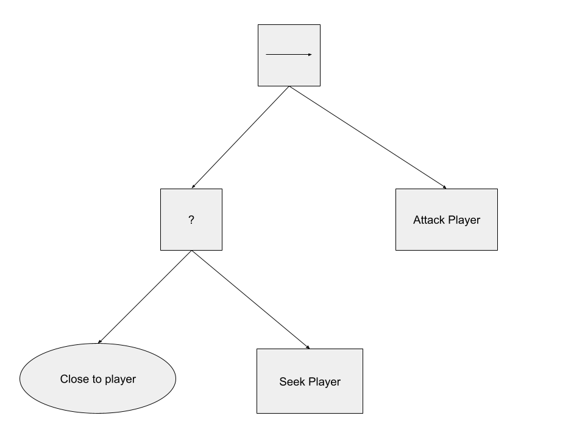

# Behaviour Tree implementation in Unity3D.

This repository contains an implementation of `Behaviour Trees` as described in [Behavior Trees in Robotics and AI](https://btirai.github.io) for `Unity3D` using a fluent-builder pattern. 

## How to use it.
Consider the following behaviour for an enemey AI tree:


This tree can be easily implemented using the following code:
```c#
private BehaviourTreeConditional closeToPlayer;
private BehaviourTreeAction seekPlayer;
private BehaviourTreeAction attackPlayer;

private BehaviourTree exampleEnemyAI = new BehaviourTree.Builder()
    .OpenSequence()
        .OpenFallback()
            .Conditional(closeToPlayer)
            .Action(seekPlayer)
        .Close()
        .Action(attackPlayer)
    .Close()
    .Build();


public void RunEnemyAI() {
    exampleEnemyAI.Tick();
}
```
In the `Assets/Examples/EnemyAI` folder, there is a complete scene that reproduces this particular example for demostration purposes.


## Further improvements.
At the moment, the only way to construct a behaviour tree is using plain code, as shown above. Having a custom inspector that would allow to create trees from the editor in a visual manner would greatly improve the understanding of more complex behaviours.